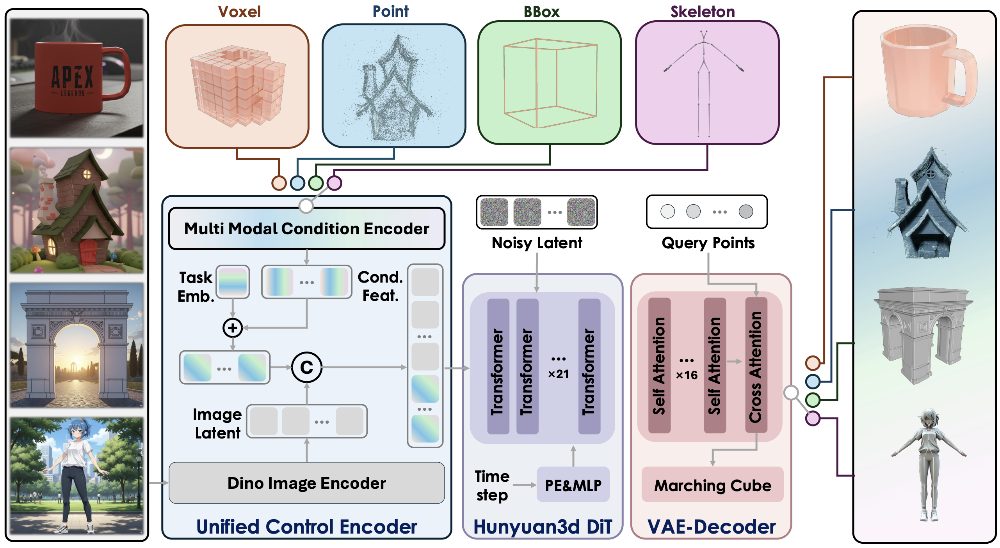

<p align="center">
  
</p>

<div align="center">
  <a href=https://3d.hunyuan.tencent.com target="_blank"></a>
  <a href=https://huggingface.co/tencent/Hunyuan3D-Omni target="_blank"></a>
  <a href=https://3d-models.hunyuan.tencent.com/ target="_blank"></a>
  <a href=https://discord.gg/dNBrdrGGMa target="_blank"></a>
  <a href=https://arxiv.org/pdf/2509.21245 target="_blank"></a>
  <a href=https://x.com/TencentHunyuan target="_blank"></a>
 <a href="#community-resources" target="_blank"></a>
</div>

[//]: # (  <a href=# target="_blank"></a>)

[//]: # (  <a href=# target="_blank"></a>)

[//]: # (  <a href="#"></a>)
<br>

# Hunyuan3D-Omni

Hunyuan3D-Omni is a unified framework for the controllable generation of 3D assets, which inherits the structure of Hunyuan3D 2.1. In contrast, Hunyuan3D-Omni constructs a unified control encoder to introduce additional control signals, including point cloud, voxel, skeleton, and bounding box.

<p align="left">
  
</p>

### Multi-Modal Conditional Control
- **Bounding Box Control**: Generate 3D models constrained by 3D bounding boxes
- **Pose Control**: Create 3D human models with specific skeletal poses  
- **Point Cloud Control**: Generate 3D models guided by input point clouds
- **Voxel Control**: Create 3D models from voxel representations

## 🎁 Models Zoo

It takes 10 GB VRAM for generation.


| Model                      | Description                 | Date       | Size | Huggingface                                                                               |
|----------------------------|-----------------------------|------------|------|-------------------------------------------------------------------------------------------| 
| Hunyuan3D-Omni        | Image to Shape Model with multi-modal control       | 2025-09-25 | 3.3B | [Download](https://huggingface.co/tencent/Hunyuan3D-Omni/tree/main)         |


## Installation

### Requirements
We test our model with Python 3.10.
```bash
pip install torch==2.5.1 torchvision==0.20.1 torchaudio==2.5.1 --index-url https://download.pytorch.org/whl/cu124
pip install -r requirements.txt
```

## Usage

### Inference

#### Multi-Modal Inference
```bash
python inference.py --control_type <control_type> [--use_ema] [--flashvdm]
```
The `control_type` parameter has four available options:

`point`: Use point control type for inference.  
`voxel`: Use voxel control type for inference.  
`bbox`: Use bounding box control type for inference.  
`pose`: Use pose control type for inference.

The `--use_ema` flag enables the use of Exponential Moving Average (EMA) model for more stable inference.

The `--flashvdm` flag enables FlashVDM optimization for faster inference speed.

Please choose the appropriate control_type based on your requirements. For example, if you want to use the `point` control type, you can run:
```bash
python inference.py --control_type point 
python inference.py --control_type point --use_ema
python inference.py --control_type point --flashvdm
```

## Acknowledgements

We would like to thank the contributors to
the [TripoSG](https://github.com/VAST-AI-Research/TripoSG), [Trellis](https://github.com/microsoft/TRELLIS),  [DINOv2](https://github.com/facebookresearch/dinov2), [Stable Diffusion](https://github.com/Stability-AI/stablediffusion), [FLUX](https://github.com/black-forest-labs/flux), [diffusers](https://github.com/huggingface/diffusers), [HuggingFace](https://huggingface.co), [CraftsMan3D](https://github.com/wyysf-98/CraftsMan3D), [Michelangelo](https://github.com/NeuralCarver/Michelangelo/tree/main), [Hunyuan-DiT](https://github.com/Tencent-Hunyuan/HunyuanDiT), [HunyuanVideo](https://github.com/Tencent-Hunyuan/HunyuanVideo), [HunyuanWorld-1.0](https://github.com/Tencent-Hunyuan/HunyuanWorld-1.0), and [HunyuanWorld-Voyager](https://github.com/Tencent-Hunyuan/HunyuanWorld-Voyager) repositories, for their open research and
exploration.

## Citation

If you use this code in your research, please cite:
```bibtex
@misc{hunyuan3d2025hunyuan3domni,
      title={Hunyuan3D-Omni: A Unified Framework for Controllable Generation of 3D Assets}, 
      author={Tencent Hunyuan3D Team},
      year={2025},
      eprint={2509.21245},
      archivePrefix={arXiv},
      primaryClass={cs.CV},
      url={https://arxiv.org/abs/2509.21245}, 
}
@misc{hunyuan3d2025hunyuan3d,
    title={Hunyuan3D 2.1: From Images to High-Fidelity 3D Assets with Production-Ready PBR Material},
    author={Tencent Hunyuan3D Team},
    year={2025},
    eprint={2506.15442},
    archivePrefix={arXiv},
    primaryClass={cs.CV}
}

@misc{hunyuan3d22025tencent,
    title={Hunyuan3D 2.0: Scaling Diffusion Models for High Resolution Textured 3D Assets Generation},
    author={Tencent Hunyuan3D Team},
    year={2025},
    eprint={2501.12202},
    archivePrefix={arXiv},
    primaryClass={cs.CV}
}

@misc{yang2024hunyuan3d,
    title={Hunyuan3D 1.0: A Unified Framework for Text-to-3D and Image-to-3D Generation},
    author={Tencent Hunyuan3D Team},
    year={2024},
    eprint={2411.02293},
    archivePrefix={arXiv},
    primaryClass={cs.CV}
}
```

## Star History

<a href="https://star-history.com/#Tencent-Hunyuan/Hunyuan3D-Omni&Date">
 <picture>
   <source media="(prefers-color-scheme: dark)" srcset="https://api.star-history.com/svg?repos=Tencent-Hunyuan/Hunyuan3D-Omni&type=Date&theme=dark" />
   <source media="(prefers-color-scheme: light)" srcset="https://api.star-history.com/svg?repos=Tencent-Hunyuan/Hunyuan3D-Omni&type=Date" />
   
 </picture>
</a>
